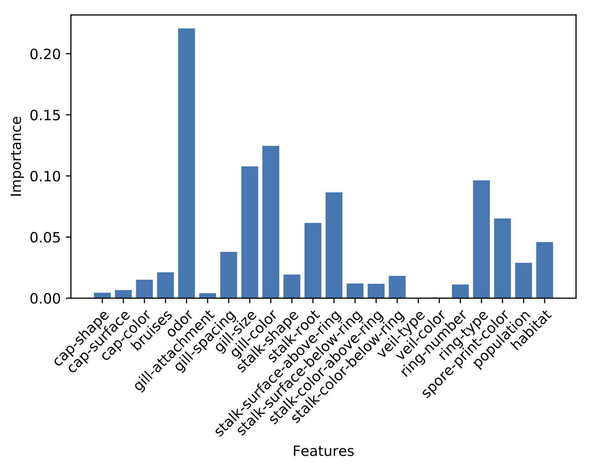

# toadstool
Predicts whether a mushroom is edible or toxic using classification models

## Plotting
Using the `plot` module we can visualize the performance of different classification models.

For example, we can use `train_percent_accuracy` to plot how each model's accuracy 
score changes as the training percentage increases:

The lower accuracy at lower training percentages can be explained by not utilizing enough training data
to effectively train each model. 

As can be seen, Random Forest and Decision Tree classification were the most accurate, reaching
scores of 1.00.

We can use `feature_importances` to visualize the importance of each feature in the Random Forest
Classifier:

